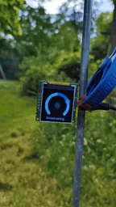
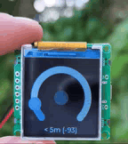

# ESP32-C3-TFT-CUBE

A wireless distance measurement system using ESP32-C3 microcontrollers with TFT displays like the [Spotpear MiniTV](https://spotpear.com/shop/ESP32-C3-desktop-trinket-Mini-TV-Portable-Pendant-LVGL-1.44inch-LCD-ST7735.html). The system consists of a sender and receiver pair that communicate using ESP-NOW protocol to measure and display the distance between them.

 

## Features

- Wireless distance measurement using RSSI (Received Signal Strength Indicator)
- Interactive TFT display interface
- Real-time distance visualization
- Configurable sender/receiver mode
- LED status indicators
- ESP-NOW communication protocol

## Hardware Requirements

- [ESP32-C3 Mini TV](https://spotpear.com/shop/ESP32-C3-desktop-trinket-Mini-TV-Portable-Pendant-LVGL-1.44inch-LCD-ST7735.html)
- ESP32-C3 development board with TFT display
- Onboard LED

## Software Components

### main.c
The main application file that handles:
- LVGL UI initialization and management
- Screen transitions and UI elements
- Button handling and user interaction
- Mode selection (Sender/Receiver)
- Display updates and animations

### common.c
Provides common functionality:
- Timestamp management for callbacks
- Shared utilities between sender and receiver

### sender.c
Implements the sender functionality:
- ESP-NOW initialization and configuration
- Periodic data broadcasting
- Send status monitoring
- LED feedback for successful transmissions

### receiver.c
Implements the receiver functionality:
- ESP-NOW initialization and configuration
- Signal reception and processing
- Distance calculation using RSSI values
- Real-time distance updates

## Setup Instructions for [ESP32-C3 Mini TV](https://spotpear.com/shop/ESP32-C3-desktop-trinket-Mini-TV-Portable-Pendant-LVGL-1.44inch-LCD-ST7735.html)

1. Configure the onboard LED:
```bash
espefuse.py -p COM* burn_efuse VDD_SPI_AS_GPIO 1
```

2. Build and flash the project using ESP-IDF:
```bash
idf.py build
idf.py -p COM* flash
```

3. Configure the sender's MAC address in `sender.c` to match your receiver's MAC address.

## Distance Measurement

The system uses a log-distance path loss model to estimate distance based on RSSI values. The calculation can be calibrated by adjusting:
- `RSSI_AT_1_METER`: Expected RSSI value at 1 meter distance
- `PATH_LOSS_EXPONENT`: Signal attenuation factor (typically 2.0-4.0)

## License

MIT License

Copyright (c) 2024

Permission is hereby granted, free of charge, to any person obtaining a copy
of this software and associated documentation files (the "Software"), to deal
in the Software without restriction, including without limitation the rights
to use, copy, modify, merge, publish, distribute, sublicense, and/or sell
copies of the Software, and to permit persons to whom the Software is
furnished to do so, subject to the following conditions:

The above copyright notice and this permission notice shall be included in all
copies or substantial portions of the Software.

THE SOFTWARE IS PROVIDED "AS IS", WITHOUT WARRANTY OF ANY KIND, EXPRESS OR
IMPLIED, INCLUDING BUT NOT LIMITED TO THE WARRANTIES OF MERCHANTABILITY,
FITNESS FOR A PARTICULAR PURPOSE AND NONINFRINGEMENT. IN NO EVENT SHALL THE
AUTHORS OR COPYRIGHT HOLDERS BE LIABLE FOR ANY CLAIM, DAMAGES OR OTHER
LIABILITY, WHETHER IN AN ACTION OF CONTRACT, TORT OR OTHERWISE, ARISING FROM,
OUT OF OR IN CONNECTION WITH THE SOFTWARE OR THE USE OR OTHER DEALINGS IN THE
SOFTWARE.
